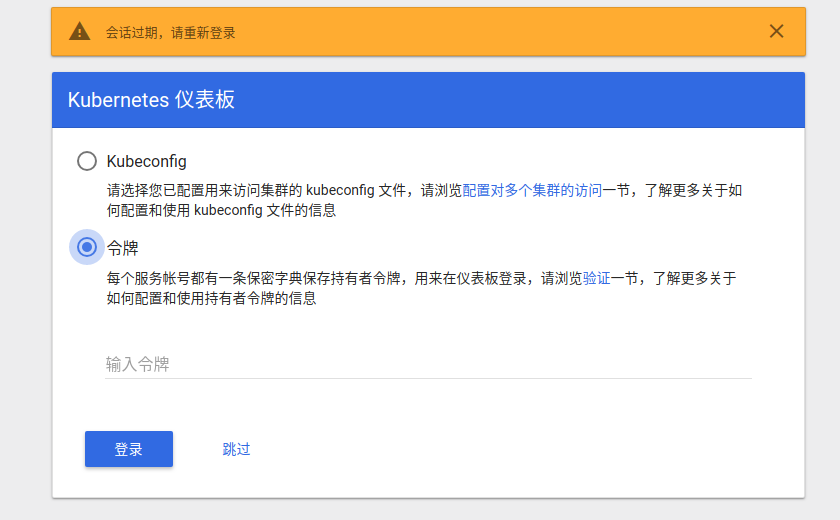
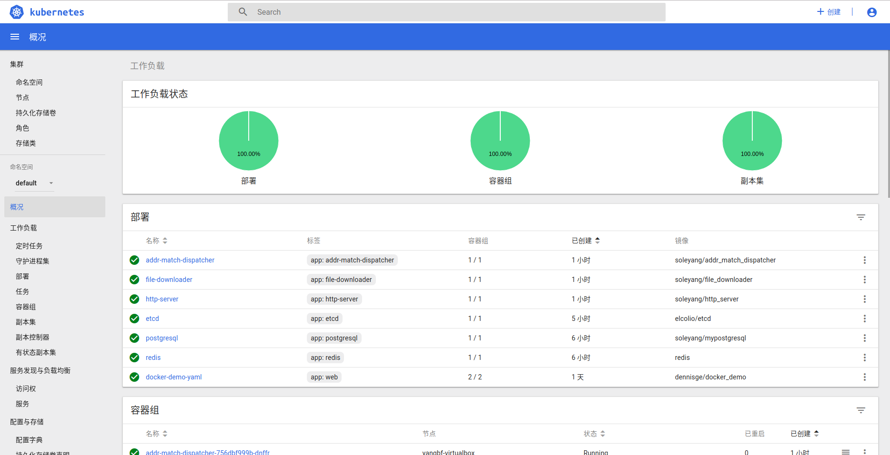

# 大前提：国内无法访问gcr io,需要使用docker将镜像拖到国内
## kubeadm,kubectl and kubelet 安装
### [官网推荐](https://kubernetes.io/docs/tasks/tools/install-kubeadm/)
```
apt-get update && apt-get install -y apt-transport-https curl
curl -s https://packages.cloud.google.com/apt/doc/apt-key.gpg | apt-key add -
cat <<EOF >/etc/apt/sources.list.d/kubernetes.list
deb http://apt.kubernetes.io/ kubernetes-xenial main
EOF
apt-get update
apt-get install -y kubelet kubeadm kubectl
```
### 问题一：网络问题
* 解决方案：使用proxychains:
```
$ proxychains apt-get curl ...
$ proxychains apt-get update
```
### 问题二：使用proxychains依旧无法添加秘钥
* 报错内容：
```
gpg: no valid OpenPGP data found.
```
* 解决方案：
```
#先将秘钥文件下载到本地
$ proxychains curl -O https://packages.cloud.google.com/apt/doc/apt-key.gpg
# 添加下载在当前目录的秘钥文件(apt-key.gpg为前一条指令下载的文件)
$ apt-key add apt-key.gpg
OK
```
### 安装docker
```
$ apt-get install  docker.io
$ docker version   显示版本信息
```
## 部署kubernetes Master节点
```
$ kubeadm init --kubernetes-version=v1.11.0 --pod-network-cidr=10.244.0.0/16
```
* 加`--kubernetes-version`参数执行，如果不加则报错（还是网络问题，proxychains无效）：
```
unable to get URL "https://dl.k8s.io/release/stable-1.11.txt": Get https://storage.googleapis.com/kubernetes-release/release/stable-1.11.txt: read tcp 172.16.3.170:60992->172.217.24.16:443: read: connection reset by peer
```
### 修改配置
* kubelet 关闭swap
```
#/etc/systemd/system/kubelet.service.d/10-kubeadm.conf
Environment="KUBELET_SWAP_ARGS=--fail-swap-on=false"
ExecStart=+ $KUBELET_SWAP_ARGS
```
* 修改`/etc/default/kubelet`(若在`kubelet.service.d/10-kubeadm.con`添加过则不修改此处):
```
KUBELET_EXTRA_ARGS=--pod-infra-container-image=soleyang/pause-amd64
```
* 修改`/etc/systemd/system/kubelet.service.d/10-kubeadm.conf`（若可以自由访问gcr.io可忽略，修改kubeadm init 使用国内镜像此处必须修改）
```
# vim /etc/systemd/system/kubelet.service.d/10-kubeadm.conf

Environment="KUBELET_INFRA_IMAGE=--pod-infra-container-image=soleyang/pause-amd64:3.1"
ExecStart=+ $KUBELET_INFRA_IMAGE
```
* 统一docker和kubeadm的[cgroup](https://github.com/SoleGH/much_more/issues/10)
```
# 确认docker的cgroup driver

$ docker info |grep -i cgroup
Cgroup Driver: cgroupfs

# 查看kubeadm 的cgroup

$ sudo cat /etc/systemd/system/kubelet.service.d/10-kubeadm.conf
# Note: This dropin only works with kubeadm and kubelet v1.11+
......
Environment="KUBELET_CGROUP_ARGS=--cgroup-driver=cgroupfs"

# 若不一样，则设置成一样

$ vi /etc/systemd/system/kubelet.service.d/10-kubeadm.conf
....
update KUBELET_CGROUP_ARGS=--cgroup-driver=systemd to KUBELET_CGROUP_ARGS=--cgroup-driver=cgroupfs

# ExecStart中添加 $KUBELET_CGROUP_ARGS
```
* 重启
```
$ systemctl daemon-reload
$ service kubelet restart
```
* 自定义kubeadm init 配置
```
#k8s_init.conf

apiVersion: kubeadm.k8s.io/v1alpha1
kind: MasterConfiguration
api:
  advertiseAddress: 0.0.0.0
networking:
  podSubnet: 10.244.0.0/16
etcd:
  image: soleyang/etcd-amd64:3.2.18
kubernetesVersion: v1.11.0
imageRepository: soleyang    #指定镜像源
```
* **初始化(确保kubelet状态为active),必须使用配置文件初始化，指定使用国内镜像，否则默认使用google镜像**
```
# 查看kubelet状态
$ systemctl status kubelet
$ swapoff -a && kubeadm init --config k8s_init.conf 
```
* 初始化成功
```
Your Kubernetes master has initialized successfully!

To start using your cluster, you need to run the following as a regular user:

  #执行前删除原有配置文件，避免发生配置文件原因引发无法链接服务器问题
  mkdir -p $HOME/.kube
  sudo cp -i /etc/kubernetes/admin.conf $HOME/.kube/config
  sudo chown $(id -u):$(id -g) $HOME/.kube/config

You should now deploy a pod network to the cluster.
Run "kubectl apply -f [podnetwork].yaml" with one of the options listed at:
  https://kubernetes.io/docs/concepts/cluster-administration/addons/

You can now join any number of machines by running the following on each node
as root:

  kubeadm join 172.16.3.170:6443 --token ff8o8p.pidb75sgqt87givu --discovery-token-ca-cert-hash sha256:f1f320c210ca43ca196b2b8a9c53013950fa48d994c4ec750b59a8703a33e988
```
### 安装网络组件
```
#对应podSubnet: 10.244.0.0/16
$ kubectl apply -f https://raw.githubusercontent.com/coreos/flannel/v0.10.0/Documentation/kube-flannel.yml
```
### 相关指令 [Kubernetes kubectl 命令表](http://docs.kubernetes.org.cn/683.html)
```
$ kubeadm token list
$ kubectl get nodes
$ kubectl get pod -o wide #查看服务运行在哪个节点
$ kubectl create -f *.yaml #新增deployment
$ kubectl delete -f *.yaml #删除deployment
$ kubectl expose deployment deployment_name --type=NodePort --port=5000 #暴露服务
$ kubectl get svc [deployment_name] #查询服务
$ kubectl delete svc deployment_name #删除服务
```
### 添加子节点
* 安装环境 kubeadm kubelet kubectl docker
* 配置kubelet(同master使用国内镜像)
* 使用`kubeadm init`生成的`kubeadm join --token......`添加节点
```
root@yangbf-VirtualBox:/etc/default# kubeadm join 172.16.3.170:6443 --token ff8o8p.pidb75sgqt87givu --discovery-token-ca-cert-hash sha256:f1f320c210ca43ca196b2b8a9c53013950fa48d994c4ec750b59a8703a33e988
[preflight] running pre-flight checks
I0711 10:05:46.739716   16803 kernel_validator.go:81] Validating kernel version
I0711 10:05:46.739790   16803 kernel_validator.go:96] Validating kernel config
[discovery] Trying to connect to API Server "172.16.3.170:6443"
[discovery] Created cluster-info discovery client, requesting info from "https://172.16.3.170:6443"
[discovery] Requesting info from "https://172.16.3.170:6443" again to validate TLS against the pinned public key
[discovery] Cluster info signature and contents are valid and TLS certificate validates against pinned roots, will use API Server "172.16.3.170:6443"
[discovery] Successfully established connection with API Server "172.16.3.170:6443"
[kubelet] Downloading configuration for the kubelet from the "kubelet-config-1.11" ConfigMap in the kube-system namespace
[kubelet] Writing kubelet configuration to file "/var/lib/kubelet/config.yaml"
[kubelet] Writing kubelet environment file with flags to file "/var/lib/kubelet/kubeadm-flags.env"
[preflight] Activating the kubelet service
[tlsbootstrap] Waiting for the kubelet to perform the TLS Bootstrap...
[patchnode] Uploading the CRI Socket information "/var/run/dockershim.sock" to the Node API object "yangbf-virtualbox" as an annotation

This node has joined the cluster:
* Certificate signing request was sent to master and a response
  was received.
* The Kubelet was informed of the new secure connection details.

Run 'kubectl get nodes' on the master to see this node join the cluster.

```
* **多次运行`kubeadm join`可能会出现`join`不报错，但是`kubectl describe deployment_name`提示node ip异常，这时需要手动删除网卡**
```
# 异常
 Normal   SandboxChanged          33m (x12 over 35m)   kubelet, yangbf-virtualbox  Pod sandbox changed, it will be killed and re-created.
  Warning  FailedCreatePodSandBox  15m (x101 over 34m)  kubelet, yangbf-virtualbox  (combined from similar events): Failed create pod sandbox: rpc error: code = Unknown desc = failed to set up sandbox container "b658f6ca1945ac51bb64720191ffd322cccc8b68ca1d5b40cbb6432869bf4104" network for pod "docker-demo-yaml-7bd847cd46-tvxnm": NetworkPlugin cni failed to set up pod "docker-demo-yaml-7bd847cd46-tvxnm_default" network: failed to set bridge addr: "cni0" already has an IP address different from 10.244.2.1/24
# 处理办法
$ ifconfig cni0 down
$ ifconfig flannel.1 down 
$ brctl delbr cni0
$ ip link delete flannel.1
# 然后
$ kubeadm reset
$ kubeadm join ...

```
* 在master查看新增节点(获取镜像需要时间，等一会)
```
$ kubectl get nodes
```
### 部署应用
* [详情](./deploy_app.md)
### 部署dashboard
* 若部署文件有误可用`delete`删除
```
$ kubectl delete -f kubernetes-dashboard.yaml
```
```
kubectl create -f
# 先下载`kubernetes-dashboard.yaml`，修改image源（可自由访问gcr忽略）
wget  https://raw.githubusercontent.com/kubernetes/dashboard/master/src/deploy/recommended/kubernetes-dashboard.yaml
```
* 修改Dashboard Service 在`spec`下添加`type: NodePort`
```
# ------------------- Dashboard Service ------------------- #
kind: Service
apiVersion: v1
metadata:
  labels:
    k8s-app: kubernetes-dashboard
  name: kubernetes-dashboard
  namespace: kube-system
spec:
  type: NodePort
  ports:
    - port: 443
      targetPort: 8443
  selector:
    k8s-app: kubernetes-dashboard
```
* 部署dashboard
```
$ kubectl create -f kubernetes-dashboard.yaml
```
* 授予Dashboard账户集群管理权限
新建kubernetes-dashboard-admin.rbac.yaml,获取管理集群的admin权限
```
---
apiVersion: v1
kind: ServiceAccount
metadata:
  labels:
    k8s-app: kubernetes-dashboard
  name: kubernetes-dashboard-admin
  namespace: kube-system
---
apiVersion: rbac.authorization.k8s.io/v1beta1
kind: ClusterRoleBinding
metadata:
  name: kubernetes-dashboard-admin
  labels:
    k8s-app: kubernetes-dashboard
roleRef:
  apiGroup: rbac.authorization.k8s.io
  kind: ClusterRole
  name: cluster-admin
subjects:
- kind: ServiceAccount
  name: kubernetes-dashboard-admin
  namespace: kube-system
```
* 执行
```
$ kubectl create -f kubernetes-dashboard-admin.rbac.yaml
serviceaccount/kubernetes-dashboard-admin created
clusterrolebinding.rbac.authorization.k8s.io/kubernetes-dashboard-admin created
```
* 查询kubernetes-dashboard-admin的token，登录使用
```
$kubectl -n kube-system get secret | grep kubernetes-dashboard-admin
kubernetes-dashboard-admin-token-fzl7f           kubernetes.io/service-account-token   3         2m
$ kubectl describe -n kube-system secret/kubernetes-dashboard-admin-token-fzl7f
Name:         kubernetes-dashboard-admin-token-fzl7f
Namespace:    kube-system
Labels:       <none>
Annotations:  kubernetes.io/service-account.name=kubernetes-dashboard-admin
              kubernetes.io/service-account.uid=4a72573c-84e3-11e8-a36d-00cfe044cbb0

Type:  kubernetes.io/service-account-token

Data
====
ca.crt:     1025 bytes
namespace:  11 bytes
token:      eyJhbGciOiJSUzI1NiIsImtpZCI6IiJ9.eyJpc3MiOiJrdWJlcm5ldGVzL3NlcnZpY2VhY2NvdW50Iiwia3ViZXJuZXRlcy5pby9zZXJ2aWNlYWNjb3VudC9uYW1lc3BhY2UiOiJrdWJlLXN5c3RlbSIsImt1YmVybmV0ZXMuaW8vc2VydmljZWFjY291bnQvc2VjcmV0Lm5hbWUiOiJrdWJlcm5ldGVzLWRhc2hib2FyZC1hZG1pbi10b2tlbi1memw3ZiIsImt1YmVybmV0ZXMuaW8vc2VydmljZWFjY291bnQvc2VydmljZS1hY2NvdW50Lm5hbWUiOiJrdWJlcm5ldGVzLWRhc2hib2FyZC1hZG1pbiIsImt1YmVybmV0ZXMuaW8vc2VydmljZWFjY291bnQvc2VydmljZS1hY2NvdW50LnVpZCI6IjRhNzI1NzNjLTg0ZTMtMTFlOC1hMzZkLTAwY2ZlMDQ0Y2JiMCIsInN1YiI6InN5c3RlbTpzZXJ2aWNlYWNjb3VudDprdWJlLXN5c3RlbTprdWJlcm5ldGVzLWRhc2hib2FyZC1hZG1pbiJ9.O8hBrfYOoLhs8d1DDIDuQLqzk_6eTRduGq2C6Y8zijeUymuQW-SG6raaX_33TSblxtZ4YUo6lSUVBy7oOGuQS4dNeNIhSSYpmkAv3SkYELrtLER2sNeONA1G2i_3Tb97LylT8HIzcp_qaZpuUmz8SgbYUogT_Iguw_pTITTpumAsxCNJEseA8wM3CS82QRjYyF_n_glWh4UNHpRV56SLuU53-29WWhw1prrJtVrQN7q8u5-7KIPP7zpazQQKcJmrbesYDGw01I05o1xdmE95aAKlyiJ-M6RKHRpRZEftMPdbJOdYM9LFOo3UDpCdrSEUNtWbVdzLzuOnujAf66F9HQ

```
* 登录

```
$ kubectl proxy
Starting to serve on 127.0.0.1:8001
```
* 浏览器登入[http://localhost:8001/api/v1/namespaces/kube-system/services/https:kubernetes-dashboard:/proxy/](http://localhost:8001/api/v1/namespaces/kube-system/services/https:kubernetes-dashboard:/proxy/)
 用上面查到的`token`登录


* 首页


